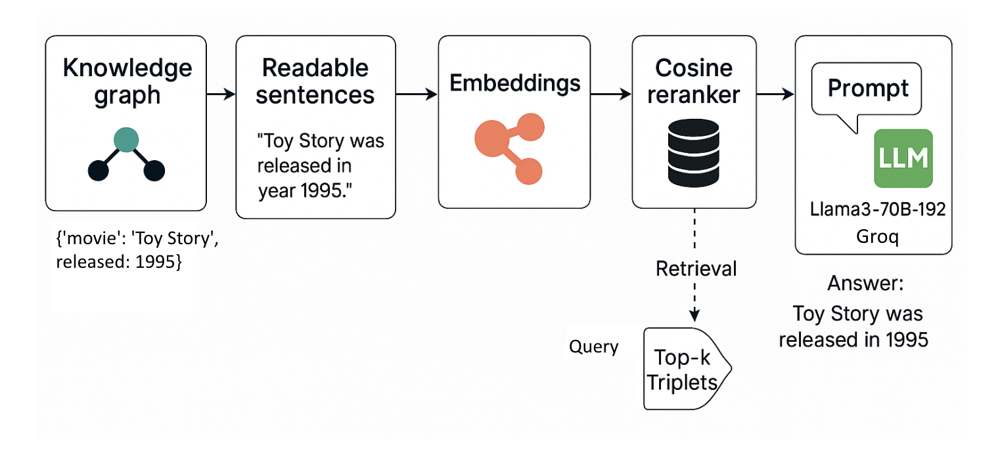

#  Enhancing Movie Recommendations Using Knowledge Graphs and RAG

> **Authors:** Axel Castellanos-Morales, Bharath Kumar A 
> **Repo:** [Movie-Recommendations-Using-Knowledge-Graphs-and-RAG](https://github.com/abharathkumarr/Movie-Recommendations-Using-Knowledge-Graphs-and-RAG)

---

##  Motivation 

Traditional recommendation systems rely heavily on collaborative or content-based filtering, which often fail to capture deeper relationships between entities. This project aims to **enhance movie recommendations** using:
- **Knowledge Graphs (KGs)** to model semantic connections
- **Retrieval-Augmented Generation (RAG)** to provide interpretable, grounded responses using LLMs

---

## Architecture



---

## Dataset

- Source: [Neo4j “recommendations” dataset](https://github.com/neo4j-graph-examples/recommendations)
- Entities & Relationships:
  - `(:Movie)-[:IN_GENRE]->(:Genre)`
  - `(:User)-[:RATED]->(:Movie)`
  - `(:Actor)-[:ACTED_IN]->(:Movie)`
  - `(:Director)-[:DIRECTED]->(:Movie)`
- **Nodes**: 28,865  
- **Edges**: 166,262

---

##  Methodology

### 1. Knowledge Triplet Construction
- Extract triplets from Neo4j and convert them into human-readable format:
  ```
  {'movie': 'Toy Story', released: 1995} → "Toy Story was released in year 1995"
  ```
- Total Sentences: **229,894**

### 2.  Embedding Generation
- Use HuggingFace **SentenceTransformers** (MiniLM) to embed triplets into 384-d vector space.

### 3.  FAISS Indexing
- Index embeddings using **FAISS** (L2 distance).
- Enables fast top-k retrieval during inference.

### 4.  Cosine Reranking
- Use cosine similarity to improve retrieval precision after FAISS.

### 5.  Retrieval-Augmented Generation (RAG)
- Use **Groq-hosted LLaMA3-70B-8192** with LangChain:
  1. Retrieve relevant triplets
  2. Format into a prompt
  3. Send to LLM for response generation

### 6. Evaluation
- **Precision** = Correct retrieved / Total retrieved  
- **Recall** = Correct retrieved / Total relevant  
- **F1 Score** = Harmonic mean of Precision and Recall

---

## Results

- High-quality movie recommendations that are **fact-grounded** and **interpretable**
- Retrieval results match Neo4j Cypher query outputs
- Enhanced relevance via RAG pipeline

---

##  References

- [Lewis et al. (2021). Retrieval-Augmented Generation (RAG)](https://arxiv.org/abs/2005.11401)  
- [Hogan et al. (2022). Knowledge Graphs](https://doi.org/10.1145/3447772)  
- [KG-Retriever (2023)](https://arxiv.org/html/2412.05547v1)  
- [Nair & Cheriyan (2023)](https://doi.org/10.1109/idciot56793.2023.10053435)  
- [Xu et al. (2024)](https://doi.org/10.1145/3626772.3661370)  
- [Neo4j Example Datasets](https://neo4j.com/docs/getting-started/appendix/example-data/)

---
